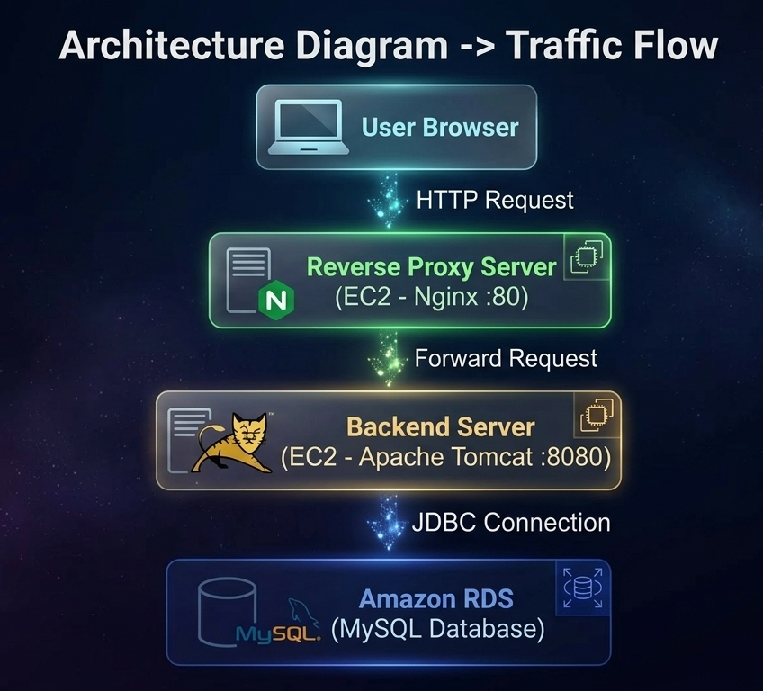
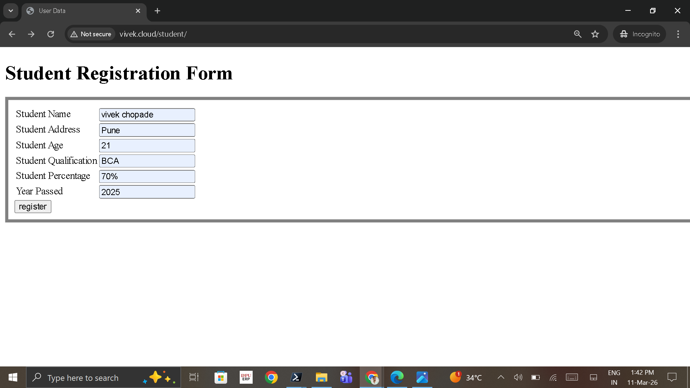
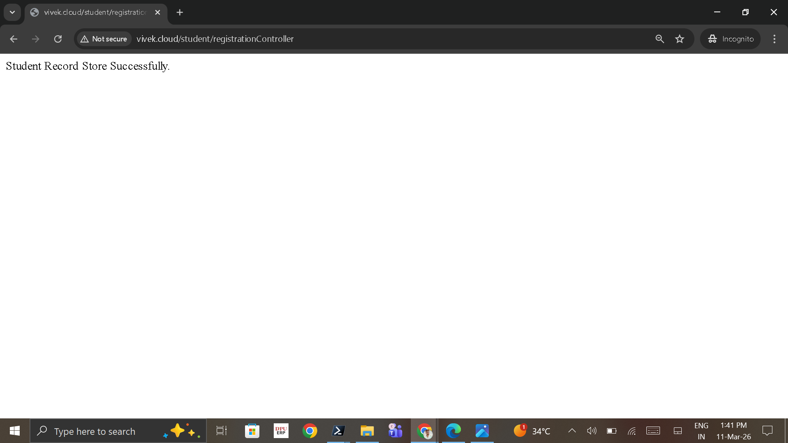
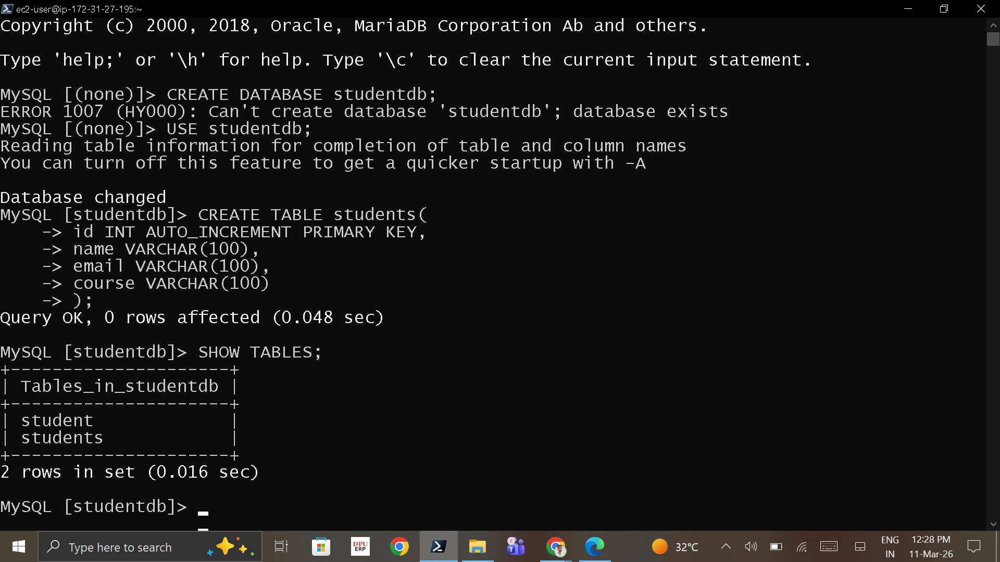
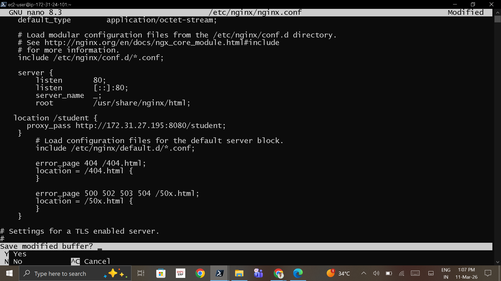
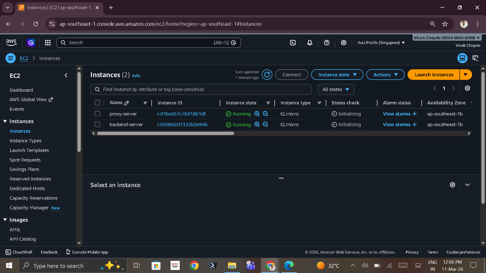

# 🚀 AWS Java Tomcat Nginx Reverse Proxy Project

This project demonstrates deployment of a **Java Student Registration Web Application on AWS** using **Apache Tomcat, Nginx Reverse Proxy, and Amazon RDS MySQL**.

The architecture follows a **Reverse Proxy model** where the public traffic is handled by Nginx and forwarded to the backend Tomcat server.

---

# 🌐 Live Application

The application is accessible using a custom domain configured with the reverse proxy.

Live URL:

http://vivek.cloud/student

---

# 🌍 Domain Configuration

A custom domain **vivek.cloud** was configured to access the application.

Steps performed:

1. Configured domain **vivek.cloud**
2. Created DNS **A record** pointing to the **Public IP of the Nginx Reverse Proxy EC2 instance**
3. Nginx reverse proxy forwards requests to the backend Tomcat server

DNS Example

Domain: vivek.cloud
Type: A Record
Value: Proxy EC2 Public IP

---

# 🔄 Request Flow Using Custom Domain

User Browser
↓
http://vivek.cloud/student
↓
Nginx Reverse Proxy (EC2)
↓
Apache Tomcat Backend Server
↓
Amazon RDS MySQL Database


---

# 📊 Architecture Diagram



---

# ⚙️ Technologies Used

| Technology       | Purpose                 |
| ---------------- | ----------------------- |
| AWS EC2          | Hosting servers         |
| Apache Tomcat    | Java servlet container  |
| Nginx            | Reverse proxy server    |
| Amazon RDS MySQL | Database                |
| Java Servlets    | Backend logic           |
| JDBC             | Database connectivity   |
| Linux            | Server operating system |

---

# 🖥️ Infrastructure Setup

Two EC2 instances were created.

### Backend Server

Runs the Java application.

* Apache Tomcat
* Java 17
* Application deployed using `.war` file
* Runs on port **8080**

Internal access

```
http://backend-ip:8080/student
```

---

### Reverse Proxy Server

Handles public traffic.

* Nginx installed
* Listens on port **80**
* Forwards requests to backend server

Public URL

```
http://vivek.cloud/student
```

---

# 📦 Application Deployment

The Java web application was deployed using a WAR file.

Location

```
/opt/tomcat/webapps/student.war
```

Start Tomcat

```
cd /opt/tomcat/bin
./startup.sh
```

---

# 🗄️ Database Setup

Amazon RDS MySQL database was created.

Database name

```
studentdb
```

---

# SQL Table Creation

```
CREATE TABLE students (
id INT AUTO_INCREMENT PRIMARY KEY,
name VARCHAR(100),
address VARCHAR(100),
age INT,
qualification VARCHAR(50),
percentage VARCHAR(10),
year_passed VARCHAR(10)
);
```

---

# 🔌 MySQL Connector

MySQL JDBC connector added to Tomcat.

```
/opt/tomcat/lib/mysql-connector.jar
```

---

# 🔁 Nginx Reverse Proxy Configuration

Configuration file

```
/etc/nginx/nginx.conf
```

Proxy configuration

```
location /student {
proxy_pass http://BACKEND_PRIVATE_IP:8080/student;
}
```

Restart Nginx

```
sudo systemctl restart nginx
```

---

# 🔐 Security Configuration

Backend server

```
Port 8080 → Only accessible from proxy server
```

Proxy server

```
Port 80 → Public access
```

---

# 📸 Screenshots

## Student Registration Form



---

## Record Stored Successfully



---

## Database Table



---

## Nginx Reverse Proxy Configuration



---

## AWS EC2 Instances



## RDS Database Stored Data

---

# 🔄 Request Flow

1. User accesses application via browser
2. Request reaches **Nginx Reverse Proxy**
3. Nginx forwards request to **Tomcat backend server**
4. Java servlet processes form submission
5. Data stored in **Amazon RDS MySQL database**
6. Response returned to the user

---

# ⚠️ Challenges Faced

### Tomcat Permission Issues

Resolved by updating directory permissions.

### Database Connection Error

Solved by adding MySQL connector and configuring RDS security groups.

### Reverse Proxy Configuration

Configured Nginx to correctly route traffic to backend server.

---

# 🎯 Conclusion

This project demonstrates deployment of a **Java Web Application on AWS using Reverse Proxy architecture**.

Skills demonstrated:

* Cloud infrastructure deployment
* Web server configuration
* Database connectivity
* Secure reverse proxy architecture

---

# 👨‍💻 Author

Vivek Chopade

DevOps & Cloud Enthusiast

---

# ⭐ Future Improvements

* Add HTTPS using Let's Encrypt
* Implement CI/CD pipeline
* Containerize application using Docker
